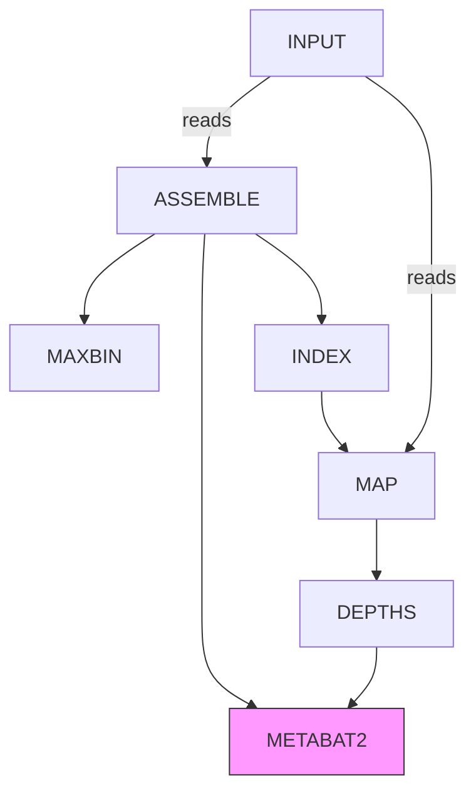
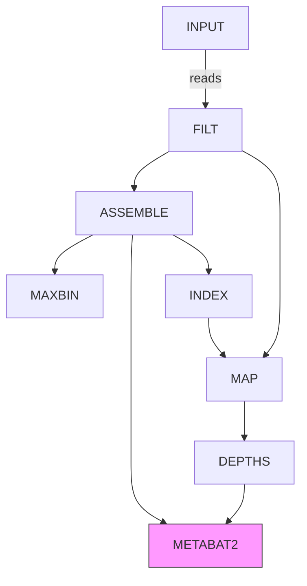

# nf-channel-error: antipattern mining

Example workflow where channels can mix loosing the synchronization with the input files.

Process **Metabat2** in this example is connected twice to the source reads, but there is no guarantee that the read pair received from **Depths** will match the read pair received via **Assembly**.

How to create a pattern to synchronize these?




## Reproduce the error

:warning: Note that multiple executions might be required as randomly the two channels might be in sync

```bash
nextflow run mess.nf
```

Check the output directory (`cat test-mess/metabat/*error.fa` to see the errors).


Alternatively, to let the pipeline crash when there is a sample mismatch:

```bash
nextflow run mess.nf --crash
```

## Workaround

`fix.nf` adds a "filtering" step that is then used downstream.





## Solution

Joining the channels (and changing the input required by the process will solve the problem, as both channels have the same key.

```nextflow
METABAT2(   ASSEMBLE.out.join(DEPTHS.out), params.crash )
```
